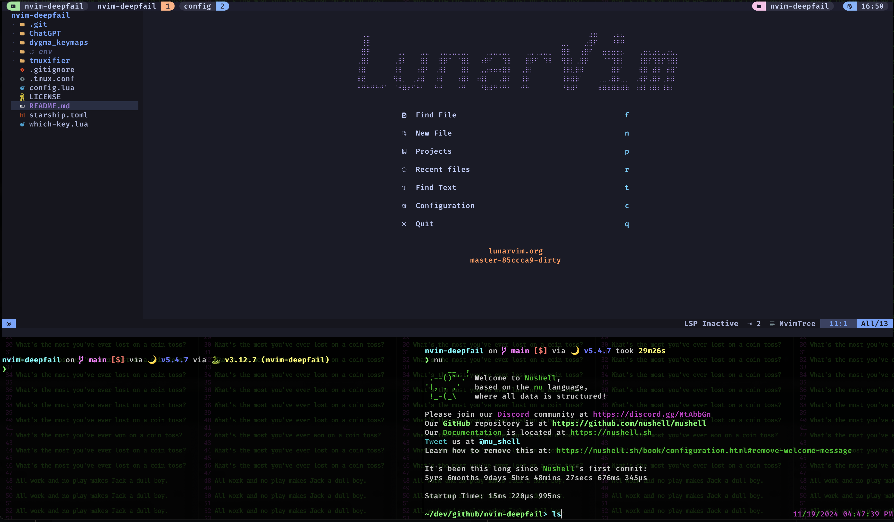

# My nvim config, a study in deepfail
young bones heal quickly edition

Story here is my painful switch to nvim from vim, but my supprising productivity now that I don't spend all day tweaking a custom color theme

Current [nvim config](./nvim) is a handrolled version of [LunarVIM](https://www.lunarvim.org/) with opionated customizations. 
I use [this config](./nvim) + `tmux` + `tmuxifier` as my daily driver for development.

- TODOs
  - copilot WK mapping
  - override/add translation for vim-regex to pcre
  - school misc
    - obsidian connector
    - I have vimtex intended for latex math notes, but is in some kinda fuggly state

### [tmux](./docs/tmux.md)
A terminal multiplexer for managing multiple shell sessions.

### [tmuxifier](./docs/tmuxifier.md)
A session manager for tmux, allowing you to create and manage complex layouts.

### Term misc
- https://www.nerdfonts.com/
- [Starship](./starship) 
- https://github.com/lsd-rs/lsd

### Keyremapping 
- caps_lock => escape, is my norm only mapping
- Trying [Dygma Defy](https://dygma.com/pages/defy) split keybort
  - configs [here](./dygma_keymaps)

