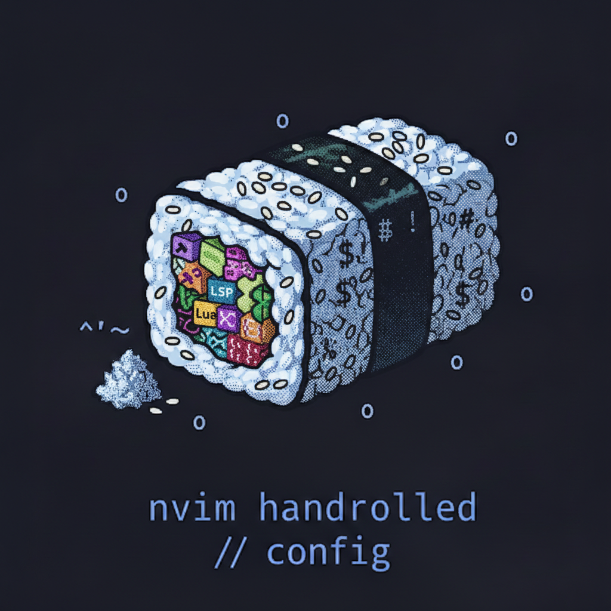

<table align="center">
  <tr>
    <td>
      
    </td>
    <td valign="middle">
      <h1>Handrolled Neovim Configuration</h1>
    </td>
  </tr>
</table>

This is a handrolled Neovim configuration migrated from [LunarVIM](https://www.lunarvim.org/), focusing on maintaining the same functionality while providing more control and customization.

## Documentation

- **[Architecture & Structure](docs/architecture.md)** - How the configuration is organized.
- **[Which-Key Discovery](docs/which-key.md)** - Visual guide to keybindings and discovery.
- **[Keymaps Cheat Sheet](docs/keymaps.md)** - All custom keybindings and menus.

## ✨ Features

- **Modern Neovim 0.12+** optimized
- **Fast startup** with lazy-loading plugins via [lazy.nvim](https://github.com/folke/lazy.nvim)
- **Tokyo Night** color scheme for a clean UI
- **Full LSP** support with advanced configuration
- **Fuzzy finding** with Telescope
- **Git integration** with Gitsigns and Lazygit
- **AI assistance** with GitHub Copilot and ChatGPT
- **Debugging** with DAP
- **Production-ready** used daily for professional work
    - **Rust** with rust-analyzer, cargo, and clippy
    - **Python** with pyright, black, and pyright
    - **Typescript** with tsserver, eslint, and prettier
    - **Other languages** will need configuration

## Installation

1. Run the setup script:
   ```bash
   ~/.config/nvim/setup.sh
   ```

2. Launch Neovim:
   ```bash
   nvim
   ```

3. Lazy.nvim will automatically install all plugins on first launch.

## Customization

See the **[Architecture](docs/architecture.md)** document for details on how to modify options, plugins, and keymaps.

---

*Migrated from LunarVIM with ❤️*
